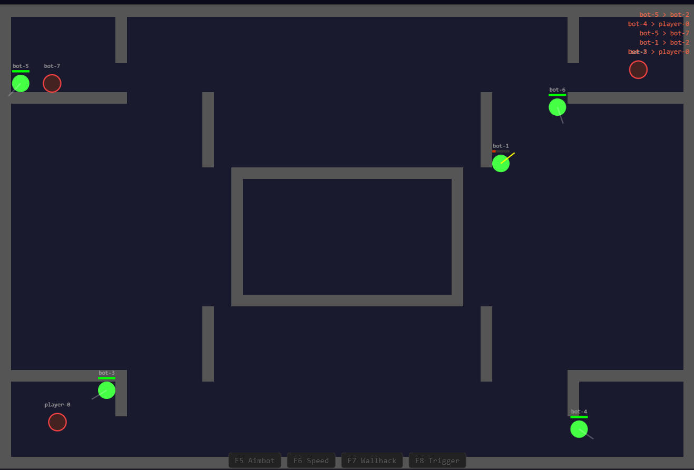
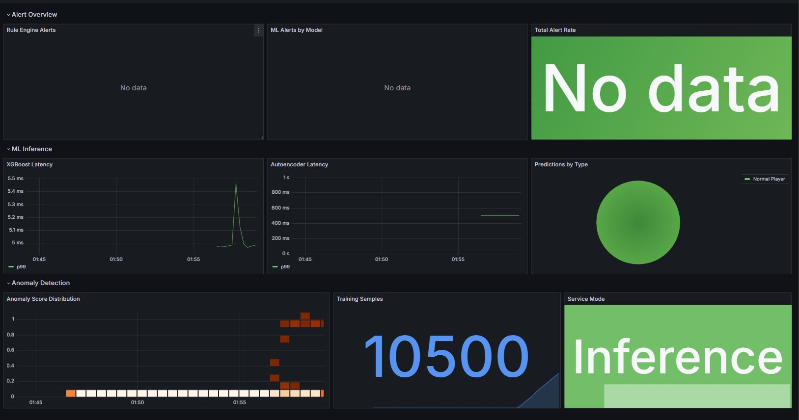
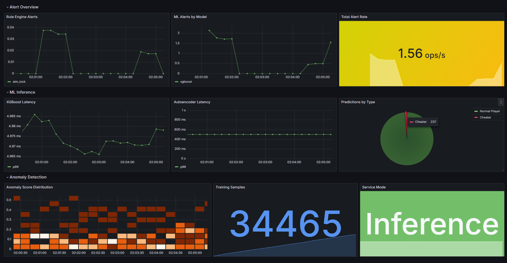
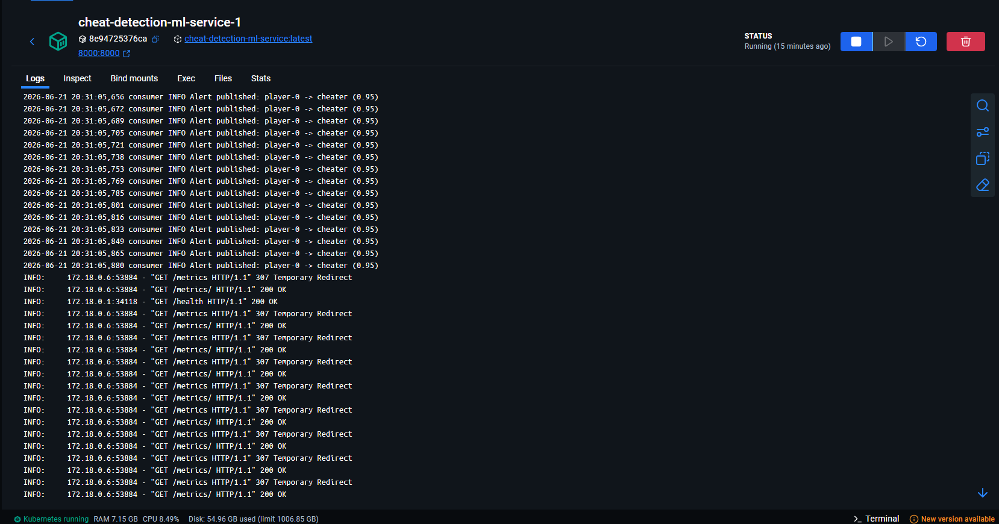
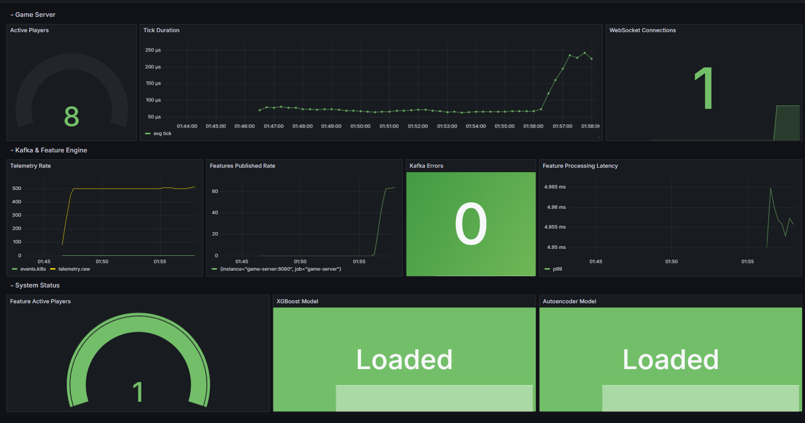
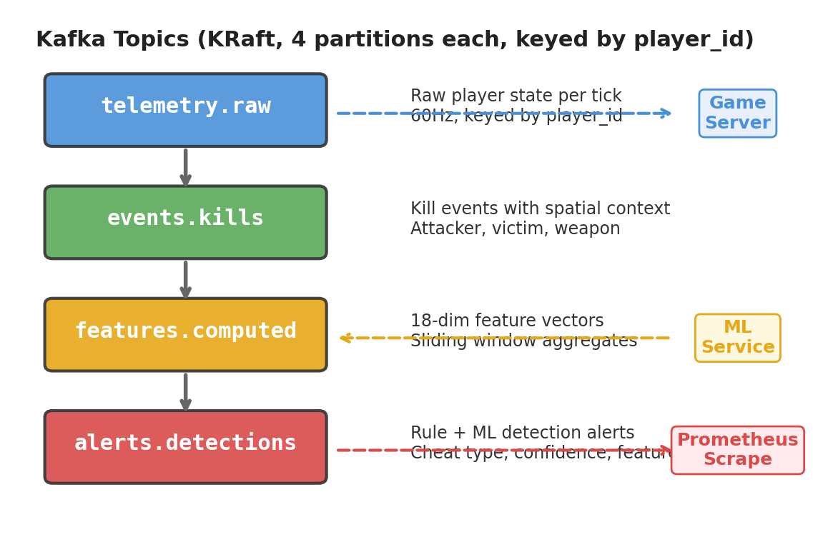
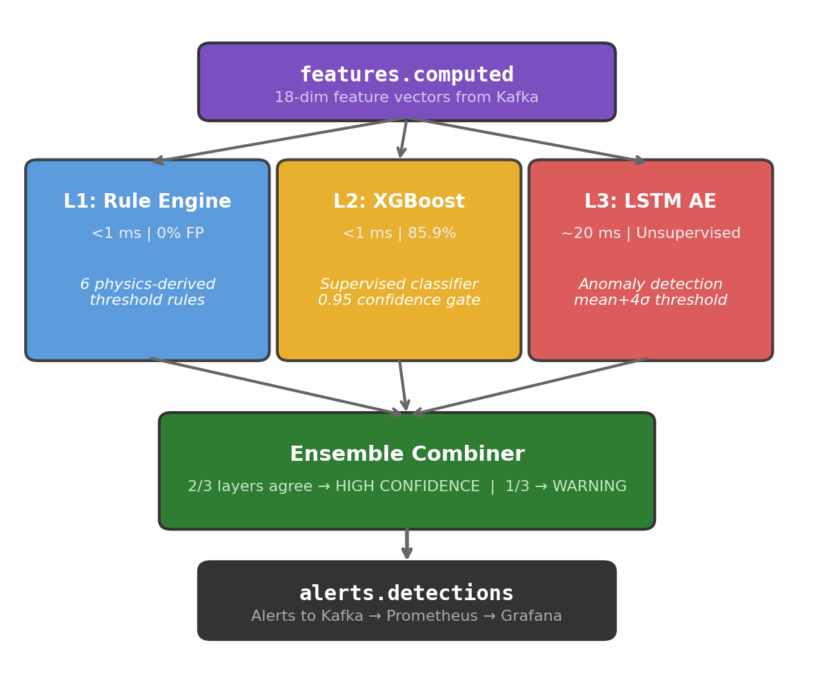
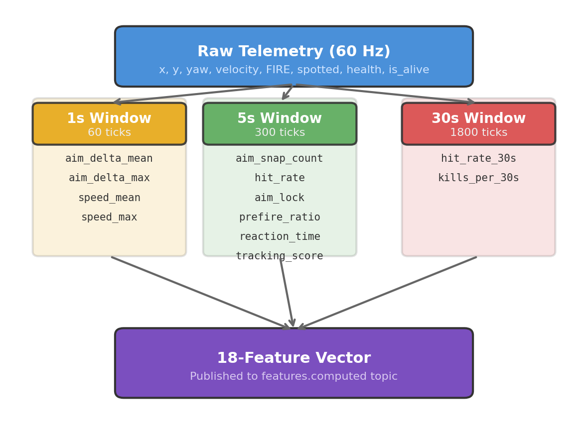

# Real-Time Cheat Detection for Multiplayer Games

A server-side real-time cheat detection pipeline that treats game clients as IoT sensor nodes. The system ingests 60 Hz player telemetry via Apache Kafka, computes 18 behavioral features using sliding windows, and runs a three-layer detection stack (physics rules + XGBoost + LSTM autoencoder) to detect cheating in under 5 seconds with full Grafana observability.

Built for **ENGR 5785G: Real-Time Data Analytics for IoT** at Ontario Tech University.

## Demo

### Game Client
The HTML5 Canvas game client with 8 AI bots. Cheat toggles (F5-F8) inject aimbot, speedhack, wallhack, and triggerbot behaviors server-side for testing.



### Detection in Action

**Clean gameplay** - all metrics nominal, zero alerts:



**Cheats enabled** - rule alerts spike, ML predictions shift to "cheater", anomaly scores jump from 0.3 to 10.0+:



**ML service logs** - real-time XGBoost predictions with confidence scores and cheat-type labels:



**Pipeline health** - 8 active players, ~540 events/sec throughput, both ML models loaded:



## Quick Start

### Prerequisites

- Docker and Docker Compose

### 1. Clone and Start

```bash
git clone https://github.com/Rohan-Muslekar/expert-broccoli.git
cd expert-broccoli
docker compose up --build -d
```

This launches all 7 containers: game server, game client, Kafka (KRaft), ML service, Prometheus, and Grafana.

### 2. Open the Game

| Service | URL |
|---------|-----|
| Game Client | http://localhost:80 |
| Grafana Dashboards | http://localhost:3000 |
| ML Service API | http://localhost:8000 |
| Prometheus | http://localhost:9091 |

### 3. Test Cheat Detection

1. Open the game client at http://localhost:80
2. Open Grafana at http://localhost:3000 - observe the clean baseline (zero alerts)
3. In the game client, press **F5** (aimbot) - watch `aim_snap` rule fire instantly in Grafana
4. Press **F6** (speedhack) - `speed_cap` rule fires, XGBoost shifts to "cheater" at >99% confidence
5. Press **F7** (wallhack) - `prefire_ratio` rule fires after ~8 seconds of shot accumulation
6. Press **F8** (triggerbot) - `triggerbot_react` rule fires within 1 second
7. Disable all cheats (F5-F8 again) - alerts stop, prediction pie returns to "normal"

### 4. Verify Pipeline Health

```bash
# Check all services are running
docker compose ps

# Check ML service status
curl http://localhost:8000/health

# List Kafka topics
docker compose exec kafka /opt/kafka/bin/kafka-topics.sh --bootstrap-server localhost:9092 --list
```

### 5. Shut Down

```bash
docker compose down        # stop all services
docker compose down -v     # stop and remove volumes
```

## Architecture

```
Game Client (HTML5 Canvas)
    |  WebSocket (60 Hz)
    v
Game Server (Go 1.22, authoritative)
    |  Kafka (KRaft, keyed by player_id)
    |---> telemetry.raw          (raw player state per tick)
    |---> events.kills           (kill events with context)
    |
    v
Feature Engine (Go, embedded)
    |  3 sliding windows: 1s / 5s / 30s
    |---> features.computed      (18-feature vectors)
    |---> alerts.detections      (rule-based alerts)
    |
    v
ML Service (Python, FastAPI)
    |  XGBoost (<1ms) + LSTM Autoencoder (~20ms)
    |---> alerts.detections      (ML-based alerts)
    |
    v
Prometheus (5s scrape) + Grafana (2 dashboards, 20+ metrics)
```



## Three-Layer Detection Stack



### Layer 1: Rule Engine (Go, <1 ms, 0% false positives)

Six physics-derived threshold rules. Each threshold sits in a dead zone between the human maximum and the cheat minimum.

| Rule | Condition | Detects |
|------|-----------|---------|
| `speed_cap` | `speed_max_1s > 7.0` | Speedhack |
| `aim_snap` | `aim_delta_max_1s > 2.0 rad` | Aimbot |
| `inhuman_accuracy` | `hit_rate_5s > 85%` | Aimbot |
| `aim_lock` | `aim_lock_ratio > 90%` | Aimbot |
| `prefire` | `prefire_ratio > 60%` | Wallhack |
| `triggerbot_react` | `reaction_time < 3 ticks` | Triggerbot |

### Layer 2: XGBoost Classifier (<1 ms per tick)

Supervised binary classifier trained on 175K labeled samples from the CS2CD dataset (795 real CS2 matches). Confidence gate at 0.95 suppresses borderline false positives.

- `max_depth=6, learning_rate=0.1, n_estimators=200, subsample=0.8`
- Train/test split by player ID (not timestamp) to prevent data leakage

### Layer 3: LSTM Autoencoder (~20 ms)

Unsupervised anomaly detector trained only on clean gameplay. Detects novel cheat types never seen during training by flagging high reconstruction error.

- Encoder: LSTM(18,64) -> LSTM(64,32)
- Decoder: LSTM(32,32) -> LSTM(32,64) -> Dense(64,18)
- Anomaly threshold: `mean + 4*std = 0.53 + 4*0.15 = 1.12`

## Results

| Metric | Value |
|--------|-------|
| XGBoost Accuracy | 85.9% |
| XGBoost F1 (weighted) | 85.1% |
| Confidence Threshold | 0.95 |
| Rule Engine FP Rate | 0% |
| LSTM Anomaly Mean (clean) | 0.53 |
| LSTM Alert Threshold | 1.12 |
| XGBoost Inference | <1 ms |
| LSTM Inference | ~20 ms |
| End-to-End Latency | <5 s (cheat to Grafana) |
| Throughput | ~540 events/sec (9 players at 60 Hz) |

### Per-Cheat Detection Behavior

| Cheat | Detection Time | Primary Detector | Signal |
|-------|---------------|-----------------|--------|
| Speedhack (F6) | Instant (same tick) | Rule: `speed_cap` | velocity 4.0 -> 12.5 units/tick |
| Aimbot (F5) | Instant (same tick) | Rule: `aim_snap` | aim delta 3.14 rad vs human max 0.5 |
| Triggerbot (F8) | <1 second | Rule: `triggerbot_react` | reaction time drops to 1-2 ticks |
| Wallhack (F7) | ~8 seconds | Rule: `prefire` + LSTM | prefire ratio accumulates over shots |

## 18 Computed Features



| Feature | Window | Cheat Signal |
|---------|--------|-------------|
| `aim_delta_mean` | 1s, 5s | Aimbot snap magnitude |
| `aim_delta_max` | 1s | Peak aim discontinuity |
| `aim_snap_count` | 5s | Jumps > 0.5 rad |
| `aim_to_enemy_offset` | 5s | Crosshair-enemy angle |
| `hit_rate` | 5s, 30s | Shooting accuracy |
| `shots_fired` | 5s | Fire frequency |
| `kills_per_30s` | 30s | Kill rate |
| `time_to_kill_mean` | 30s | Time-to-kill speed |
| `speed_mean` | 1s, 5s | Movement speed |
| `speed_max` | 1s | Peak speed |
| `direction_change_count` | 5s | Erratic movement |
| `aim_lock_ratio` | 5s | Crosshair tracking |
| `prefire_ratio` | 5s | Shooting through walls |
| `reaction_time_mean` | 5s | Response time |
| `enemy_tracking_score` | 5s | Aim-enemy correlation |

## Components

| Component | Language | Port | Description |
|-----------|----------|------|-------------|
| [game-server](game-server/) | Go 1.22 | 8080 | Authoritative 60 Hz server, 8 AI bots, feature engine, 6 rule detectors |
| [game-client](game-client/) | JavaScript | 80 | HTML5 Canvas client with F5-F8 cheat toggles |
| [ml-service](ml-service/) | Python 3.11 | 8000 | FastAPI with XGBoost + LSTM autoencoder ensemble |
| Kafka | KRaft | 9092 | 4 topics, 4 partitions each, keyed by `player_id` |
| Prometheus | - | 9091 | 5-second scrape from game-server and ml-service |
| Grafana | - | 3000 | Pipeline Health + Detection Analytics dashboards |

## ML Training

Pre-trained models are included in `ml-service/saved_models/`. To retrain:

```bash
# Train on live game data (collect samples first)
curl -X POST http://localhost:8000/train

# Train on CS2CD dataset (place parquet files in datasets/cs2cd/)
curl -X POST http://localhost:8000/train/cs2cd
```

The CS2CD dataset (Dorner et al., 2024) contains 795 real CS2 competitive matches totaling 48.9 GB. Of 225 raw columns, we extract 12 behaviorally relevant fields and project them onto 18 computed features.

## Deliverables

- [IEEE Technical Report](docs/IEEE_Cheat_Detection_Report.docx)
- [Final Presentation](docs/Final_Presentation.pptx)

## Project Structure

```
cheat-detection/
  game-server/        # Go game server + feature engine
  game-client/        # HTML5 Canvas frontend
  ml-service/         # Python ML service (FastAPI)
  infra/              # Kafka, Prometheus, Grafana configs
  datasets/           # CS2CD dataset (not committed)
  docs/               # IEEE report + final presentation
  screenshots/        # System screenshots and diagrams
  docker-compose.yml  # Full stack orchestration
  Makefile            # Build and run shortcuts
```

## Team

| Member | Component | Responsibilities |
|--------|-----------|-----------------|
| Ankit | Game Client + Kafka | HTML5 Canvas, WebSocket, KRaft setup, player_id partitioning |
| Rohan | Server + Feature Engineering | 60 Hz authoritative server, ring-buffer windows, 6 rule detectors |
| Siddhartha | XGBoost Training | CS2CD parser, player-ID split, hyperparameter tuning, confidence gating |
| Priyanka | LSTM Autoencoder | Clean-only training, MSE reconstruction, threshold calibration |
| Nithilan | Grafana Dashboards | Auto-provisioned dashboards, PromQL queries, anomaly heatmap |
